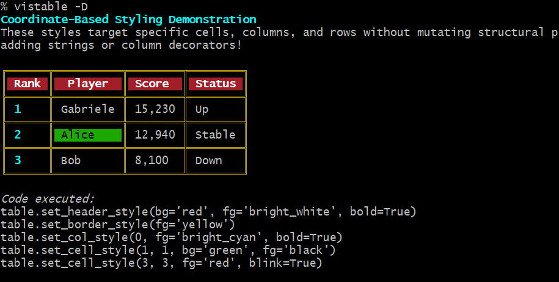
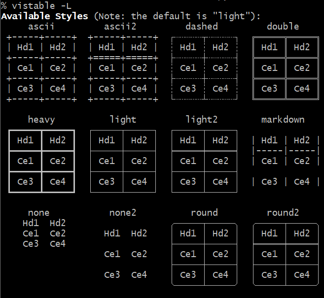
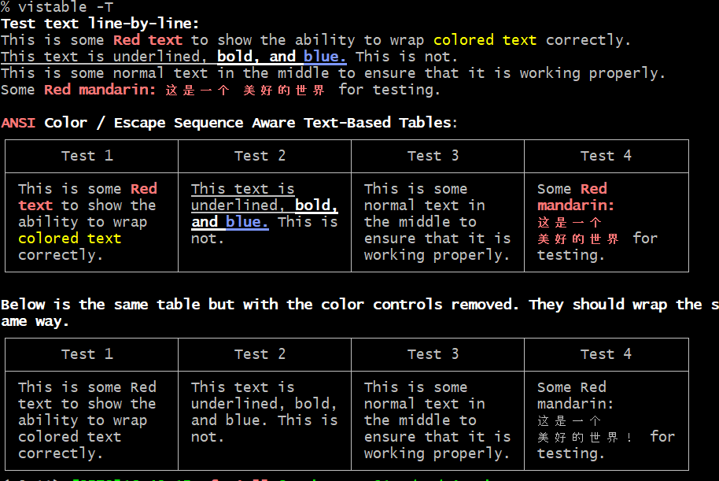

# vistab

`vistab` is a lightweight, zero-dependency Python module for creating beautiful text-based ASCII/Unicode tables. It comes out-of-the-box with support for fluid terminal formatting (ANSI escape sequences), coordinate-based discrete cell styling, and guarantees consistent string lengths across dense color variations.

## Key Features

- **Zero-Dependency Core**: Operates purely off the Python standard library with intelligent fallbacks.
- **Color-Aware Word Wrapping**: Dynamically measures and wraps table widths natively over embedded invisible ANSI formatting sequences without breaking table structural geometry.
- **Coordinate-Based Styling API**: Fluently colorize rows, columns, headers, or discrete cells declaratively (e.g. `set_header_style(bg="red", bold=True)`).
- **Hierarchical TOML Configurations**: Persist your favorite table paddings and layout themes cross-project using a localized `.vistab.toml`.
- **Advanced Data Parsing**: Injects automatic text wrapping arrays, infers dynamic scientific datatypes, and parses robust CSVs intuitively.

## Installation

You can install `vistab` directly via pip:

```bash
pip install vistab
```

> **Note**: For complex Asian/CJK full-width character wrapping support, install the optional component using `pip install vistab[cjk]`.

## Quick Start

Getting started with `vistab` is simple. Initialize a `Vistab` instance, set up column alignments and paddings, and append your rows!

```python
from vistab import Vistab

table = Vistab(style="round2", padding=1)
# Left, Right, Center alignment
table.set_cols_align(["l", "r", "c"])
# Top, Middle, Bottom vertical alignment
table.set_cols_valign(["t", "m", "b"])

table.add_rows([
    ["Name", "Age", "Nickname"],
    ["Ms\nSarah\nJones", 27, "Sarah"],
    ["Mr\nJohn\nDoe", 45, "Johnny"],
    ["Dr\nEmma\nBrown", 34, "Em"]
])

print(table.draw())
```

**Output:**
```
╭─────────┬─────┬───────────╮
│ Name    │ Age │ Nickname  │
╞═════════╪═════╪═══════════╡
│ Ms      │     │           │
│ Sarah   │  27 │           │
│ Jones   │     │   Sarah   │
├─────────┼─────┼───────────┤
│ Mr      │     │           │
│ John    │  45 │           │
│ Doe     │     │  Johnny   │
├─────────┼─────┼───────────┤
│ Dr      │     │           │
│ Emma    │  34 │           │
│ Brown   │     │    Em     │
╰─────────┴─────┴───────────╯
```

## Coordinate-Based Cell Styling

`vistab` natively supports a fluent, declarative API to inject background colors, foreground colors, and text styles (like bolding and underlining) targeting specific grids—ranging from individual cells, whole rows, columns, headers, or borders—organically applying cleanly without twisting table decorator strings!



## Hierarchical Configuration System
Stop re-typing your constructor arguments recursively! `vistab` actively scans your execution environments for TOML configurations natively. 

It searches `[./.config/vistab.toml, ./.vistab.toml, ~/.config/vistab.toml, ~/.vistab.toml]` securely over zero-dependencies. 

You can instantly generate a boiler-plate configuration file to test using the CLI command:
```bash
python vistab.py --create-config .vistab.toml
```

## Built-in Structural Themes

`vistab` comes with predefined structural themes rendering cleanly under `light`, `bold`, `double`, `ascii`, `round2`, `markdown`, and more native variants.

You can view a full structural geometry matrix natively printed on your terminal by executing:
```bash
python vistab.py -L
```


## Discovering Output Colors (CLI)

Because terminal color renderings vary natively across different user host profiles and color palettes, `vistab` comes packaged with a native matrix test exposing every foreground, background, and stylistic text augmentation you can safely deploy. 

You can view the palette directly on the console by executing:
```bash
python vistab.py -C
```


## ANSI Color Layout Support

A major benchmark advantage of `vistab` is native, invisible terminal styling support. Common ASCII libraries will typically break their visual wrapper alignments when raw terminal colors are embedded because they incorrectly count invisible geometry bytes.

You can view a comprehensive color-wrapping conformance test demonstrating dynamic alignment across complex CJK blocks by executing:
```bash
python vistab.py -T
```


## Advanced Formatting (Datatypes)

`vistab` can infer and parse formatting rules strictly by passing data types, controlling precision dynamically for scientific floats and integers seamlessly.

```python
from vistab import Vistab

table = Vistab(style="ascii")
table.set_cols_dtype(['t', 'f', 'e', 'i', 'a']) 
table.set_cols_align(["l", "r", "r", "r", "l"])

table.add_rows([
    ["text", "float", "exp", "int", "auto"],
    ["alpha", "23.45", 543, 100, 45.67],
    ["beta", 3.1415, 1.23, 78, 56789012345.12],
    ["gamma", 2.718, 2e-3, 56.8, .0000000000128]
])
```

## License

This project is licensed under the BSD 3-Clause License. See [LICENSE](LICENSE) for details.
